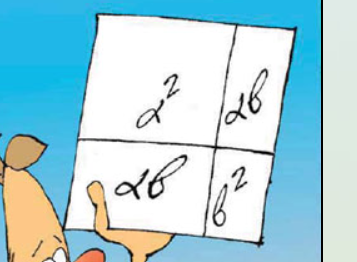

# Άλγεβρα

## 1.3, 1.4 Πολυώνυμα

### Περιγραφή

### Νέο Πρόγραμμα Σπουδών

Αλ.Π.9.7. Να παραγοντοποιούν απλά πολυώνυμα (κυρίως μιας μεταβλητής) με κοινό παράγοντα, ομαδοποίηση και χρήση ταυτοτήτων.

### Συνεργατική εφαρμογή

κάτι παρόμοιο με τα νευρωνικα;;

## 1.5 Αξιοσημείωτες ταυτότητες

### Νέο Πρόγραμμα Σπουδών

Αλ.Π.9.4. Να διερευνούν και να αποδεικνύουν αλγεβρικά και να ερμηνεύουν (όπου είναι δυνατόν) γεωμετρικά τις
ταυτότητες:
- $(\alpha \pm \beta)^2 = \alpha^2 \pm 2\alpha\beta + \beta^2$
- $\alpha^2 - \beta^2 = (\alpha - \beta)(\alpha + \beta)$

### Ενσώματη διάσταση

Να δείχνει το εμβαδόν στο τετράγωνο που σχηματίζουν οι μαθητές ώστε να προκύπτει η ταυτότητα. Τρεις μαθητές που σχηματίζουν το παρακάτω σχήμα

### Συνεργατική εφαρμογή

## 1.8 Ε.Κ.Π. και Μ.Κ.Δ. ακεραίων αλγεβρικών παραστάσεων

### Νέο Πρόγραμμα Σπουδών

Αλ.Π.9.8. Να προσδιορίζουν το ΕΚΠ μονωνύμων και απλών πολυωνύμων μιας μεταβλητής.

## 3.1 Η έννοια της γραμμικής εξίσωσης

### Ενσώματη διάσταση

Δύο μαθητές αποτελούν τα σημεία μιας ευθείας. Όπως κινούνται η εξίσωση αλλάζει

### Συνεργατική εφαρμογή

## 3.2 Η έννοια του γραμμικού συστήματος και η γραφική επίλυσή του

### Ενσώματη διάσταση

Τέσσερεις μαθητές, δύο ευθείες που τέμνονται. Παράλληλες;

### Συνεργατική εφαρμογή

Παρόμοιο με [μικροεφαρμογή](https://lor.photodentro.edu.gr/items/e90d2393-bc91-453f-b386-f4f778b27286/player)

## Καρτεσιανές συντεταγμένες;;;;;