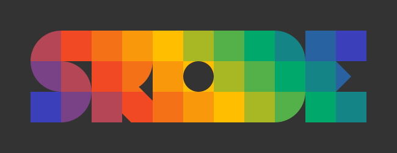

# Όλες οι εφαρμογές

## Ελληνικά - Αγγλικά

Να υποστηρίζονται και οι 2 γλώσσες για να μπορούν οι εφαρμογές να εφαρμοστούν σε κοντινές μας τάξεις αλλά και να μπορούν να μεταφερθούν σε κάποια δημοσίευση. 

## Τεχνολογία

Να υλοποιηθούν όλες οι εφαρμογές σε react.

# buffon-needle

# fourier

# geometry-live

# neural-lab

## Αλλαγές (TODO)

### αλλαγές στην διεπαφή

- όλα τα input να μην είναι τελείως ελεύθερα (δυσκολεύτηκαν στην τάξη). Να υπάρχει επιλογή μεταξύ τιμών; π.χ. {-2, -1, 0, 1, 2}.
- να υπάρχει διαχωρισμός (χρωματικός;) μεταξύ δραστηριοτήτων. Αντί για επιλογή μπορεί να δοκιμαστεί ένα περιορισμένο customized input με τους αριθμούς και το -. Ίσως στα χρώματα του λογοτύπου ώστε να βλέπουν άμεσα ότι βρίσκονται στην ίδια δραστηριότητα με τον δάσκαλο/εποπτικό μέσο

- οι students να μην έχουν πουθενά accordion ή επιλογές εμφάνισης. Όλη η τάξη να έχει μπροστά της το ίδιο περιβάλλον
- σε κάθε δραστηριότητα να φαίνεται (χωρίς δυνατότητα scroll) και ο *τίτλος* της δραστηριότητας
- Το δεξί εικονίδιο να περιλαμβάνει μόνο ❌ η ✅ ανάλογα με το αν τα τρέχοντα βάρη βρίσκουν το δεξί ότι είναι αριστερό. Θέλει λίγο σκέψη.
- Αν μπει bias άλλη μια γραμμή με ένα κενό πεδίο ακριβώς κάτω από το πεδίο βαρών. Δίπλα στο σύνολο απλά μια ένδειξη >=0.
- Θέλει προσοχή όταν αλλάζουμε από τη μια δραστηριότητα στην άλλη. Πρέπει αυτό να γίνεται σαφές στους μαθητές. Π.χ. να βγαίνει μια ειδοποίηση στο κέντρο της οθόνης ότι "τώρα αλλάζουμε δραστηριότητα" Αλλιώς, η αυτόματη αλλαγή του περιβάλλοντος τους ξενίζει, μοιάζζει με τα glitches στο matrix.

### bias ή threshold
Στο πλαίσιο όπου εμφανίζεται ο κανόνας (με ή χωρίς threshold) να μην υπάρχει άλλη πληροφορία. 

#### Με bias 
Να δοκιμαστεί πιλοτικά με 1-2 παιδιά ποια επιλογή είναι καλύτερη (bias ή threshold). Να δούμε βιβλιγραφικά πώς γίνονται τέτοιου είδους μικρο-δοκιμές, όχι επίσημα εκετατεμένα πειράματα. 

Στην πρώτη εκδοχή,  ο κανόνας είναι

- σκορ > 0 →Μέσα
- σκορ < 0 → Έξω 
- σκορ = είσοδος x βάρος + τιμή (bias) 

Παράδειγμα στη μία διασταση:
- Ποδήλατα (2 ρόδες)
- Αυτοκίνητα (4 ρόδες)
- Πατίνια (4 ρόδες)
- Φορτηγά (6 ρόδες)

Θέλουμε να διακρίνουμε/επιλέξουμε φορτηγά:
- βάρος = 1
- bias = -5
Θέλουμε να διακρίνουμε/επιλέξουμε ποδήλατα:
- βάρος = -1, 
- bias = +3

π.χ. σκορ
ποδήλατο  +1
αυτοκίνητο/πατίνι -1
φορτηγό   -3

Βλέπουμε και εδώ ότι χρειάζονται τα βάρη αν θέλουμε να διακρίνουμε πράγματα μικρά και μεγάλα.
Θέλουμε να επιλέξουμε αυτοκίνητα/πατίνια: ΔΕΝ ΜΠΟΡΟΥΜΕ ΝΑ ΤΟ ΚΑΝΟΥΜΕ! Δύσκολο να το διαπιστώσουν, ακόμη και στη μία διάσταση γιατί και εδώ οι παράμετροι είναι 2!!!

#### Χωρίς bias (ενσωματωμένο στον κανόνα)

Αν ΔΕΝ έχουμε bias, τότε το threshold to δίνουμε εμείς (όπως στο paper). Αυτό παιδαγωγικά είναι σωστό γιατί είναι scaffolding/υποστήριξη του μαθητή, ο οποίος παλεύει μόνο με το βάρος.

Στα παραπάνω παραδείγματα:

4´: Θέλουμε να διακρίνουμε φορτηγά: Ο κανόνας  παύει να είναι ο ίδιος (σκορ >0). Τώρα ο κανόνας είναι: 
σκορ > 5

βάρος = 1 (εύκολο)

5´: Θέλουμε να διακρίνουμε ποδήλατα: Τώρα το bias πάει στο άλλο μέλος και θα γίνει αρνητικό. Βάζουμε κανόνα 
σκορ > -3

Τότε το σωστό βάρος είναι: -1:
ποδήλατο  2x(-1) =-2 > -3
αυτοκίνητο/πατίνι -4 < -3
φορτηγό   -6 < -3

Καθώς το ξανασκέφτομαι, η καλύτερη επιλογή είναι η πρώτη (ΠΑΝΤΑ σκορ > 0).  Το scaffolding γίνεται απλά δίνοντας (ο δάσκαλος) το threshold και όχι ζητώντας να το βρει ο μαθητής. Αυτό αποφεύγει να συγκρίνει ο μαθητής δύο αρνητικούς όπως στην δεύτερη περίπτωση.

## Προσθήκες

### logs

Τί θέλουμε να κρατήσουμε. Εύκολο το ότι καθε "κίνηση" στέλνεται στον server. Να αποθηκεύεται σε αρχείο;

### inputs

Να υπάρχουν data sets με περισσότερα inputs
- άσχετο Input: να μην επηρεάζει καθόλου ουσιαστικά το αποτέλεσμα 

### outputs
- Περισσότερα outputs

### layers
- κρυφά layers

### training

- περισσότερα παραδείγματα (train και test) ώστε τα βάρη να βρίσκονται μόνα τους
- cost function
- training
- Backpropagation Algorithm

### μη γραμμικότητα

- Activation Functions

### αυτοματοποίηση

Ο εκπαιδευτικός (κάποια έτοιμα παραδείγματα και ο developer (εμείς)) να μπορεί να δημιουργήσει και να αποθηκεύσει σενάρια που να μην χρειάζεται να γίνεται επιλογή από τα αντίστοιχα dropdown αλλά να επιλέγει απλά προηγούμενο - επόμενο.

### Γραφική παράσταση

Παραδείγματα πάνω στην ευθεία (1 Input) ή στο επίπεδο (2 input) που να διαχωρίζονται από ένα σημείο (1 Input) ευθεία. Να αλλάζουν (το σημείο ή η ευθεία) όταν γίνονται ενημέρωση στα βάρη

### confusion matrix -> μήπως ανταγωνιστικό;

Υπάρχουν μετρικές οι οποίες μπορούν να χρησιμοποιηθούν για να βαθμολογήσουμε τους μαθητές μας.

# AR εφαρμογή για κλασματα (Κρεμμυδιώτη) TODO
- AR.js: ελαφριά βιβλιοθήκη για WebAR
- WebXR Device API: πρότυπο W3C που παρέχει πρόσβαση σε δυνατότητες AR και VR
OpenCV.js